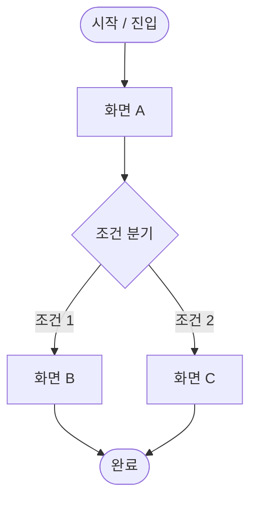

# [기능명] 화면 흐름도 v{버전}

> 상태: `🟡 초안` | 작성자: `` | 작성일: `YYYY-MM-DD` | 최종수정: `YYYY-MM-DD`

---

## 변경 이력

| 버전 | 날짜 | 작성자 | 주요 변경 내용 |
|------|------|--------|--------------|
| v1 | YYYY-MM-DD | | 최초 작성 |

---

## 1. 개요

| 항목 | 내용 |
|------|------|
| 대상 기능 | |
| 진입점 (Entry Point) | |
| 종료점 (Exit Point) | |
| 관련 사용자 유형 | |

---

## 2. 전체 흐름 다이어그램

> 💡 Mermaid 문법 외에도 Figma 흐름도 링크를 첨부하거나, 이미지를 삽입하세요.
> Figma 링크: 

---

## 3. 화면별 상세 정의

### 화면 A — [화면명]

| 항목 | 내용 |
|------|------|
| 화면 ID | SCR-001 |
| 진입 조건 | |
| 화면 목적 | |
| 와이어프레임 | [링크](../02_기획화면/) |

**주요 UI 요소**
- [ ] 요소 1
- [ ] 요소 2

**가능한 액션 및 다음 화면**
| 사용자 액션 | 다음 화면 | 조건 |
|------------|---------|------|
| 버튼 클릭 | 화면 B | — |
| 뒤로 가기 | 이전 화면 | — |

**에러 / 예외 처리**
| 케이스 | 처리 방법 |
|--------|---------|
| | |

---

### 화면 B — [화면명]

| 항목 | 내용 |
|------|------|
| 화면 ID | SCR-002 |
| 진입 조건 | |
| 화면 목적 | |
| 와이어프레임 | [링크](../02_기획화면/) |

**주요 UI 요소**
- [ ] 요소 1
- [ ] 요소 2

**가능한 액션 및 다음 화면**
| 사용자 액션 | 다음 화면 | 조건 |
|------------|---------|------|
| | | |

---

## 4. 엣지 케이스 / 예외 흐름

| 케이스 | 발생 조건 | 처리 방식 | 관련 화면 |
|--------|---------|---------|---------|
| 네트워크 오류 | API 실패 | 에러 토스트 노출 후 재시도 | 모든 화면 |
| | | | |

---

## 5. 관련 문서

- 기획서: [링크](../01_기획서/)
- 와이어프레임: [링크](../02_기획화면/)
- 의사결정 로그: [링크](../04_히스토리/결정로그.md)
