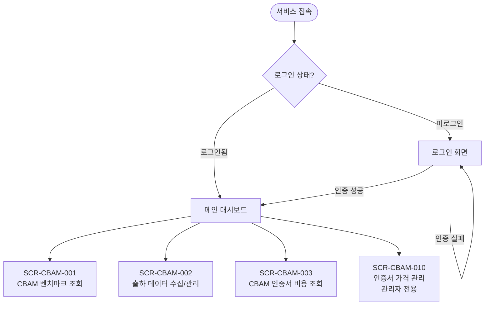
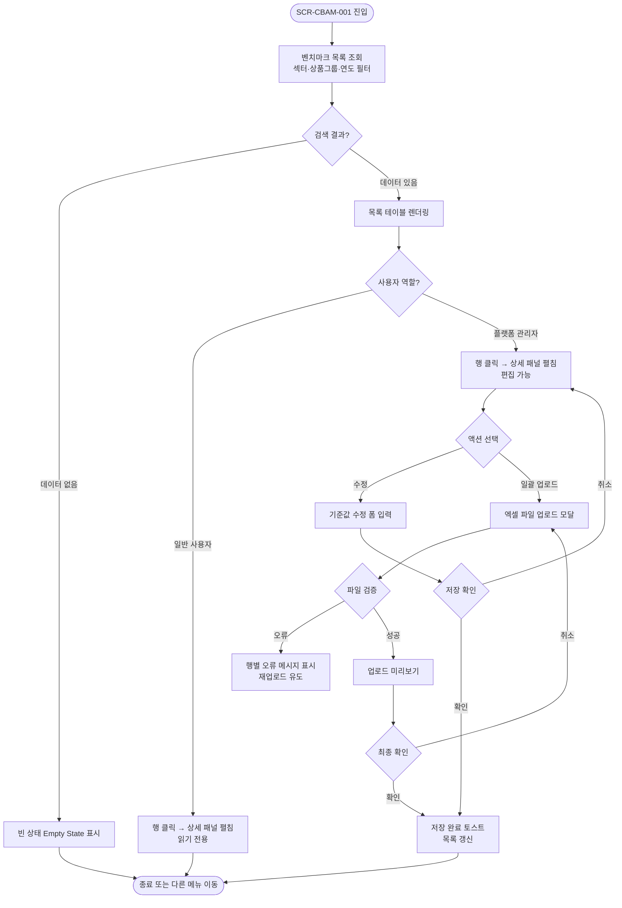
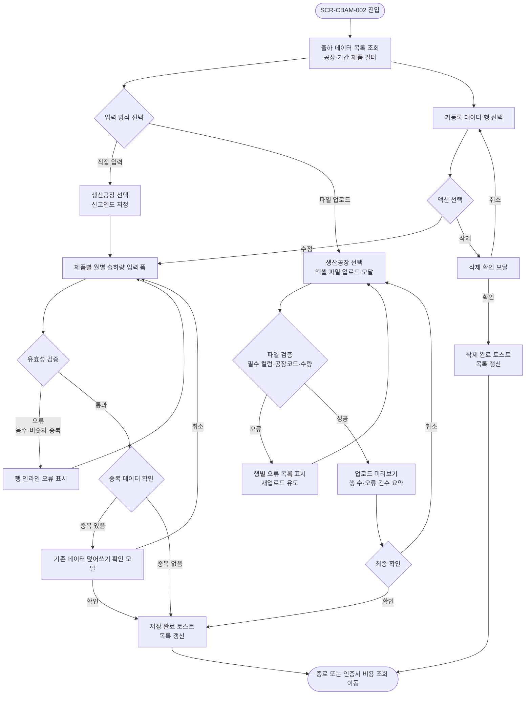
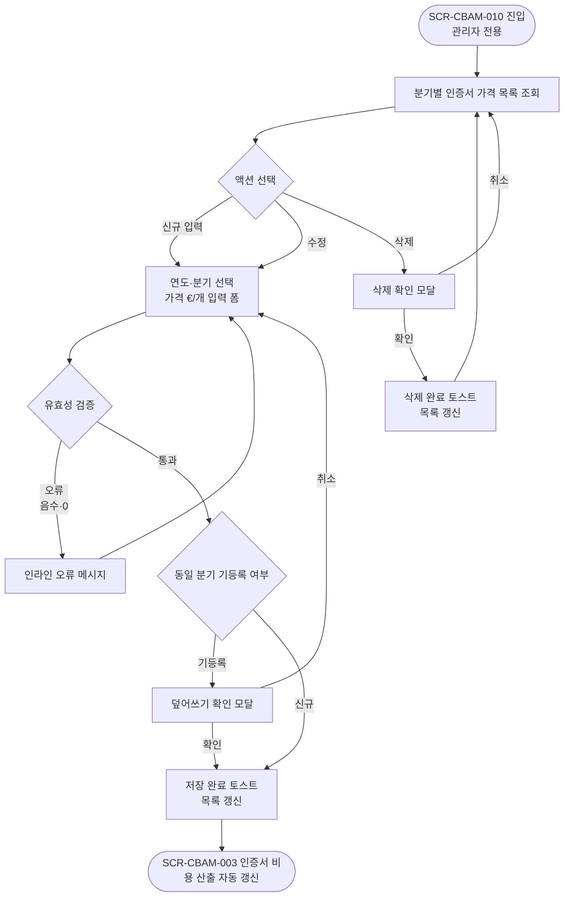

# Compli·Law CBAM SaaS — 전체 화면흐름도 v1

> 상태: `🟡 초안` | 작성자: `임지현` | 작성일: `2026-05-19`

---

## 변경 이력

| 버전 | 날짜 | 작성자 | 주요 변경 내용 |
|------|------|--------|--------------|
| v1 | 2026-05-19 | 임지현 | 최초 작성 |

---

## 1. 개요

| 항목 | 내용 |
|------|------|
| 대상 기능 | CBAM SaaS 전체 서비스 흐름 |
| 진입점 | 서비스 접속 (로그인) |
| 종료점 | 인증서 비용 조회 확인 / 세션 종료 |
| 관련 사용자 | 수출 담당자, 탄소 회계 담당자, 생산·수출 운영 담당자, 플랫폼 관리자 |

---

## 2. 전체 흐름



---

## 3. 화면별 상세

---

### SCR-CBAM-001 — CBAM 벤치마크 조회

| 항목 | 내용 |
|------|------|
| 진입 조건 | 로그인 후 메인 메뉴 → "CBAM 벤치마크" 클릭 |
| 화면 목적 | CN코드별 벤치마크·무상할당 기준값 조회 및 연도별 이력 확인 |



**가능한 액션**

| 사용자 액션 | 다음 화면/상태 | 조건 |
|------------|-------------|------|
| 섹터·상품그룹·연도 필터 적용 | 목록 즉시 갱신 | 필터 변경 시 자동 |
| CN코드 검색 | 검색 결과 반영 | 검색어 입력 후 Enter 또는 검색 버튼 |
| 행 클릭 | 상세 패널 펼침 | — |
| 수정 저장 | 저장 완료 토스트 + 목록 갱신 | 관리자 전용 |
| 엑셀 일괄 업로드 | 업로드 미리보기 모달 | 관리자 전용, .xlsx 파일만 허용 |

**에러/예외**

| 케이스 | 처리 |
|--------|------|
| 검색 결과 없음 | 빈 상태(Empty State) + 필터 초기화 버튼 안내 |
| 동일 CN코드+연도 중복 등록 | 경고 토스트 + 기존 데이터 수정 모드로 자동 전환 |
| API 오류 | 에러 토스트 "데이터를 불러오지 못했습니다. 다시 시도해 주세요." + 재시도 버튼 |

---

### SCR-CBAM-002 — 출하 데이터 수집/관리

| 항목 | 내용 |
|------|------|
| 진입 조건 | 로그인 후 메인 메뉴 → "출하 데이터" 클릭 |
| 화면 목적 | 공장별·제품별·기간별 출하(수출) 데이터 등록, 조회, 수정, 삭제 |



**가능한 액션**

| 사용자 액션 | 다음 화면/상태 | 조건 |
|------------|-------------|------|
| 직접 입력 | 월별 출하량 입력 폼 활성화 | 생산공장·신고연도 선택 후 |
| 엑셀 업로드 | 파일 업로드 모달 | .xlsx만 허용, 최대 10,000행 |
| 행 수정 | 인라인 편집 모드 | — |
| 행 삭제 | 삭제 확인 모달 → 삭제 완료 | — |

**에러/예외**

| 케이스 | 처리 |
|--------|------|
| 음수·비숫자 입력 | 인라인 오류 메시지 "0 이상의 숫자를 입력해 주세요" |
| 동일 공장+제품+기간 중복 | 덮어쓰기 확인 모달 표시 |
| 엑셀 필수 컬럼 누락 | 행별 오류 목록 + 수정 후 재업로드 안내 |
| 존재하지 않는 공장/제품 코드 | 행 강조(빨간색) + 오류 사유 표시 |
| 파일 업로드 처리 시간 초과(30초) | 에러 토스트 + 재시도 버튼 |

---

### SCR-CBAM-003 — CBAM 인증서 비용 조회

| 항목 | 내용 |
|------|------|
| 진입 조건 | 로그인 후 메인 메뉴 → "인증서 비용 조회" 클릭 |
| 화면 목적 | 분기별 CBAM 인증서 예상 구매 수량 및 비용 산출·조회, 제품별 수출량 상세 확인 |

```mermaid
flowchart TD
    R1([SCR-CBAM-003 진입]) --> R2[분기·생산공장 필터 선택]
    R2 --> R3{선행 데이터 충족 여부\n출하량 + 벤치마크 + 인증서 가격}
    R3 -->|출하량 미등록| R4[안내 배너\n출하 데이터 등록 링크 제공]
    R3 -->|인증서 가격 미확정 분기 포함| R5[미확정 분기 셀 "-" 표시\n안내 툴팁]
    R3 -->|데이터 충족| R6[인증서 비용 산출 결과 렌더링]
    R5 --> R6
    R6 --> R7[분기별 인증서 가격 카드 표시]
    R6 --> R8[예상 수량·비용 카드 표시\n분기별 + 연간 합계]
    R6 --> R9[제품별 상세 테이블 표시]
    R9 --> R10{제품별 수출량 클릭}
    R10 --> R11[수출량 상세 조회 모달\nF-CBAM-08]
    R11 --> R12[제품코드·제품명\n월별 수출량 t 표시]
    R12 --> R13{연도 변경?}
    R13 -->|변경| R12
    R13 -->|모달 닫기| R9
    R4 --> R14([SCR-CBAM-002 이동])
    R9 --> R15([종료 또는 다른 메뉴 이동])
```

**가능한 액션**

| 사용자 액션 | 다음 화면/상태 | 조건 |
|------------|-------------|------|
| 분기·공장 필터 변경 | 비용 산출 결과 즉시 갱신 | — |
| 수출량 셀 클릭 | 수출량 상세 조회 모달 팝업 | — |
| 모달 내 연도 변경 | 해당 연도 월별 수출량 갱신 | — |
| 모달 닫기 (✕ 또는 외부 클릭) | 모달 닫힘 | — |
| 출하 데이터 등록 링크 클릭 | SCR-CBAM-002로 이동 | 출하량 미등록 안내 배너에서만 |

**에러/예외**

| 케이스 | 처리 |
|--------|------|
| 인증서 가격 미확정 분기 | 해당 분기 셀 "-" 표시 + 툴팁 "인증서 가격이 입력되지 않았습니다" |
| 필요 인증서 수량 0 이하 | 0으로 표시 + 파란색 강조 (구매 불필요) |
| 출하량 미등록 | 안내 배너 표시 + SCR-CBAM-002 이동 링크 |
| 산출 API 오류 | 에러 토스트 + 재시도 버튼 |
| 모달 데이터 없는 월 | 빈값 표시 (0이 아닌 공란) |

---

### SCR-CBAM-010 — 인증서 가격 관리 (관리자)

| 항목 | 내용 |
|------|------|
| 진입 조건 | 플랫폼 관리자 계정 로그인 → 설정 메뉴 → "인증서 가격 관리" |
| 화면 목적 | 분기별 EU ETS 인증서 시장가격 입력 및 관리 |



**가능한 액션**

| 사용자 액션 | 다음 화면/상태 | 조건 |
|------------|-------------|------|
| 신규 가격 입력 | 입력 폼 활성화 | 관리자 전용 |
| 저장 완료 | 인증서 비용 조회(SCR-CBAM-003) 자동 갱신 | 성공 저장 시 |
| 삭제 | 삭제 확인 모달 | 관리자 전용 |

**에러/예외**

| 케이스 | 처리 |
|--------|------|
| 음수 또는 0 입력 | 인라인 오류 "0보다 큰 값을 입력해 주세요" |
| 동일 연도+분기 중복 입력 | 덮어쓰기 확인 모달 |
| 저장 API 오류 | 에러 토스트 + 재시도 버튼 |

---

## 4. 역할별 접근 가능 화면

| 화면 | 수출 담당자 | 탄소 회계 담당자 | 생산·수출 운영 담당자 | 플랫폼 관리자 |
|------|:----------:|:--------------:|:------------------:|:-----------:|
| SCR-CBAM-001 벤치마크 조회 | 읽기 | 읽기 | 읽기 | 읽기+편집 |
| SCR-CBAM-002 출하 데이터 | 읽기 | 읽기 | 읽기+편집 | 읽기+편집 |
| SCR-CBAM-003 인증서 비용 조회 | 읽기 | 읽기 | 읽기 | 읽기 |
| SCR-CBAM-010 인증서 가격 관리 | — | — | — | 읽기+편집 |

---

## 5. 화면 목록

| 화면 ID | 화면명 | 유형 | 우선순위 | 상태 |
|--------|--------|------|---------|------|
| SCR-CBAM-001 | CBAM 벤치마크 조회 | 조회 목록 + 상세 | Must | 🔵 검토 중 |
| SCR-CBAM-002 | 출하 데이터 수집/관리 | 목록·등록·조회·수정 | Must | 🔵 검토 중 |
| SCR-CBAM-003 | CBAM 인증서 비용 조회 | 대시보드형 조회 | Must | 🔵 검토 중 |
| SCR-CBAM-010 | 인증서 가격 관리 | 관리자 설정 | Must | ⬜ 미작성 |

---

## 6. 에러/예외 흐름 통합

| 케이스 | 발생 조건 | 처리 방식 |
|--------|---------|---------|
| 네트워크 오류 | API 응답 실패 | 에러 토스트 "요청에 실패했습니다." + 재시도 버튼 |
| 세션 만료 | 비활동 30분 초과 | 세션 만료 모달 → 로그인 화면으로 리다이렉트 |
| 권한 없는 페이지 접근 | 일반 사용자가 관리자 전용 URL 직접 접근 | 403 접근 거부 안내 화면 표시 |
| 인증서 가격 미등록 분기 | F-CBAM-09 미입력 | SCR-CBAM-003 해당 분기 "-" 표시 |
| 선행 데이터 미충족 | 출하량 없이 비용 조회 | 안내 배너 + SCR-CBAM-002 이동 링크 |

---

## 7. 관련 문서

- 기획서: [PRD v1 전체개요](../01_기획서/PRD_v1_전체개요.md)
- 화면 프로토타입: [SCR-CBAM-001 벤치마크](../02_기획화면/SCR-CBAM-001_벤치마크.html)
- 화면 프로토타입: [SCR-CBAM-002 출하량 데이터](../02_기획화면/SCR-CBAM-002_출하데이터수집관리.html)
- 화면 프로토타입: [SCR-CBAM-003 인증서 비용 조회](../02_기획화면/SCR-CBAM-003_인증서비용조회.html)
- 의사결정 로그: [링크](../04_히스토리/결정로그.md)
