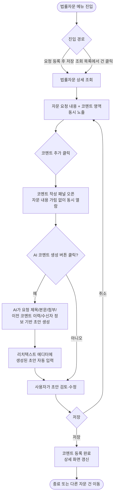
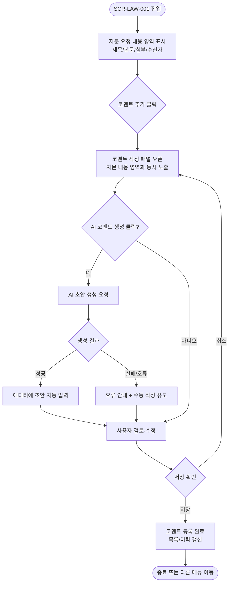

# Law.ai (DL이앤씨) — 전체 화면흐름도 v1

> 상태: `🟡 초안` | 작성자: `백교민` | 작성일: `2026-06-30`

---

## 변경 이력

| 버전 | 날짜 | 작성자 | 주요 변경 내용 |
|------|------|--------|--------------|
| v1 | 2026-06-30 | 백교민 | 최초 작성 (추정 흐름 — 실제 화면 동작 검증 필요) |

---

## 1. 개요

| 항목 | 내용 |
|------|------|
| 대상 기능 | 법률자문 상세 조회 — 코멘트 추가 / AI 코멘트 자동 생성 |
| 진입점 | 법률자문 요청 등록 또는 법률자문 조회 목록에서 건 클릭 |
| 종료점 | 코멘트 저장 완료 / 상세 조회 화면 닫기 |
| 관련 사용자 | 자문 요청자, 법무 담당자 |

> ⚠️ 본 흐름도는 지금까지 확인된 요구사항(코멘트 추가 UX 개선, AI 코멘트 자동 생성)을 기반으로 추정 작성되었습니다. 실제 화면 동작과 차이가 있을 수 있어 검증이 필요합니다.

---

## 2. 전체 흐름

---

## 3. 화면별 상세

---

### SCR-LAW-001 — 법률자문 AI코멘트

| 항목 | 내용 |
|------|------|
| 진입 조건 | GNB > 법률자문 > 법률자문 조회 > 상세 |
| 화면 목적 | 법률자문 상세 내용을 열람하며 동시에 코멘트를 작성, AI를 통한 코멘트 자동 생성 |

**가능한 액션**

| 사용자 액션 | 다음 화면/상태 | 조건 |
|------------|-------------|------|
| 코멘트 추가 클릭 | 코멘트 작성 패널 오픈 (자문 내용 가리지 않음) | — |
| AI 코멘트 생성 클릭 | AI 초안 생성 → 에디터 자동 입력 | 자문 요청 내용 존재 시 |
| 초안 수정 | 에디터 내용 갱신 | — |
| 저장 | 코멘트 등록 완료 | 필수 입력값 충족 시 |
| 취소 | 코멘트 작성 패널 닫힘 | — |

**에러/예외**

| 케이스 | 처리 |
|--------|------|
| AI 생성 실패 | 오류 안내 메시지 + 수동 작성으로 전환 |
| 필수값 미입력 후 저장 시도 | 인라인 오류 표시 |

---

## 4. 역할별 접근 가능 화면

| 화면 | 자문 요청자 | 법무 담당자 |
|------|:----------:|:-----------:|
| SCR-LAW-001 법률자문 AI코멘트 | 읽기+코멘트 작성 (권한 미정) | 읽기+코멘트 작성 (권한 미정) |

> 접근 권한은 아직 미정 상태로, 향후 역할별 열람·작성 권한 확정 필요 (Open Issue #1 참고).

---

## 5. 화면 목록

| 화면 ID | 화면명 | 유형 | 우선순위 | 상태 |
|--------|--------|------|---------|------|
| SCR-LAW-001 | 법률자문 AI코멘트 | 법률자문 조회 | Must | 🔵 검토 중 |

---

## 6. 에러/예외 흐름 통합

| 케이스 | 발생 조건 | 처리 방식 |
|--------|---------|---------|
| AI 코멘트 생성 실패 | AI 호출 오류/타임아웃 | 오류 안내 + 수동 작성 전환 |
| 필수값 미입력 | 코멘트 저장 시도 | 인라인 오류 표시 |

---

## 7. 관련 문서

- 기획서: [PRD v1 전체개요](../01_PRD/PRD_v1_전체개요.md)
- 화면 프로토타입: [SCR-LAW-001 법률자문 AI코멘트](../02_기획화면/SCR-LAW-001_법률자문_ai코멘트.html)
- 의사결정 로그: [결정로그](../04_히스토리/결정로그.md)
