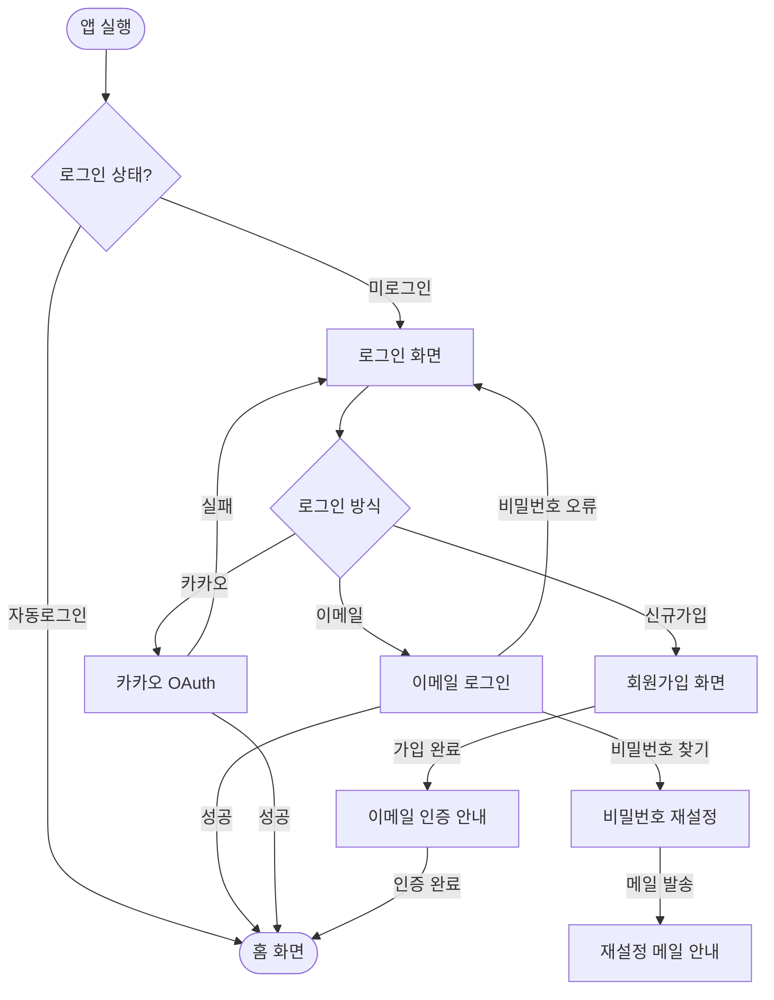

# 로그인/회원가입 화면 흐름도 v1

> 상태: `🟡 초안` | 작성자: `기획자` | 작성일: `2026-05-11`

---

## 전체 흐름 다이어그램

---

## 화면 목록

| 화면 ID | 화면명 | 와이어프레임 |
|--------|--------|------------|
| SCR-001 | 로그인 화면 | [링크](../02_기획화면/) |
| SCR-002 | 회원가입 화면 | [링크](../02_기획화면/) |
| SCR-003 | 이메일 인증 안내 | — |
| SCR-004 | 비밀번호 재설정 | — |

---

## 에러 / 예외 흐름

| 케이스 | 처리 방법 |
|--------|---------|
| 이메일 미가입 계정 로그인 시도 | "가입되지 않은 이메일입니다" 토스트 |
| 비밀번호 5회 오류 | 계정 30분 잠금 + 이메일 알림 |
| 카카오 서버 오류 | "일시적 오류" 안내 + 재시도 버튼 |
| 인증 메일 미수신 | 재발송 버튼 (1분 쿨타임) |
